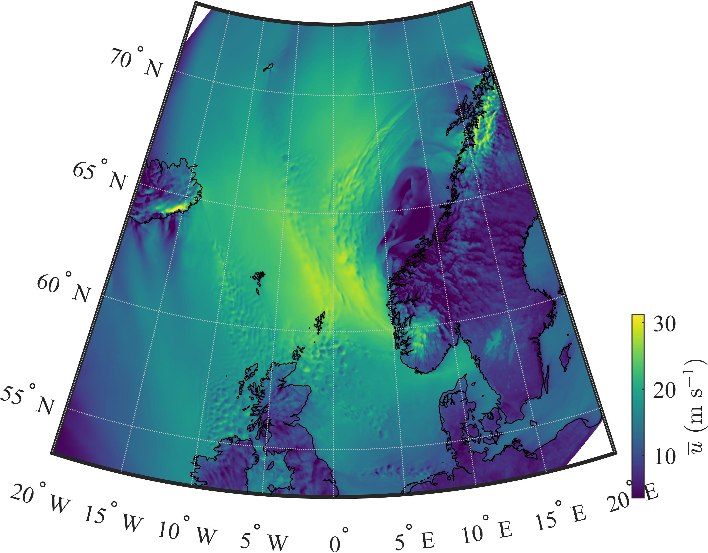

# Gridded NORA3 data: automated and remote data extraction 

## Summary
The NORA3 atmosphere hindcast data are remotely accessed using the OPeNDAP framework and the THREDDS Data Server of the Norwegian Meteorological Institute [1]. If the data are extracted for multiple latitudes and longitudes, the data are stored in a gridded format. The atmospheric data are retrieved for seven different heights, from 10 m to 750 m  above the surface. The mean wind speed profile can be interpolated using a non-linear scheme based on the Deaves and Harris model [2,3].  Above the coean, the sea roughness is modelled using Charnock relation. A summary of the NORA3 data and their potential is available in [4]. 

## Content

The present submission contains
  - getNORA3.m: A function that import the NORA3 hindcast from [1]
  - getz0_charnock.m: A function that estimate the roughness of the sea surface using Charnock's equation and the logarithmic profile of the mean wind speed.
  - interpU.m: A function that interpolate the mean wind speed using The Deaves and Harris model [2,3]
  - world.mat: A data file that contains the coastline of countries (used for visualization purpose only)
  - Documentation.mlx: A matlab livsecript that illsutrates how these functions can be used 

## References

[1] https://thredds.met.no  

[2] Harris, R. I., & Deaves, D. M. (1980, November). The structure of strong winds, wind engineering in the eighties. In Proc. CIRIA Conf.

[3] ESDU. (1985). ESDU 85020-Characteristics of atmospheric turbulence near the ground. Part II: single point data for strong winds (neutral atmosphere.

[4] Solbrekke, I. M., Sorteberg, A., & Haakenstad, H. (2021). Norwegian hindcast archive (NORA3)–A validation of offshore wind resources in the North Sea and Norwegian Sea. Wind Energy Science Discussions, 1-31.

## Example

